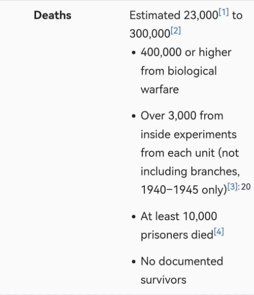
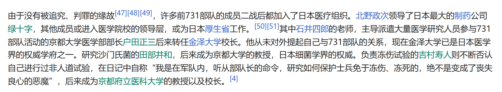
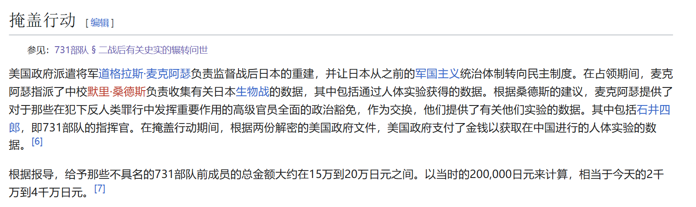
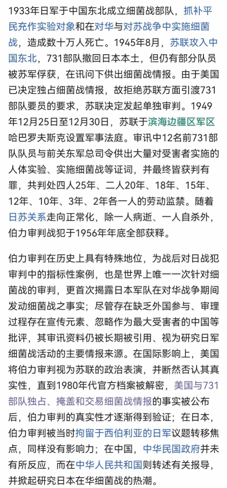
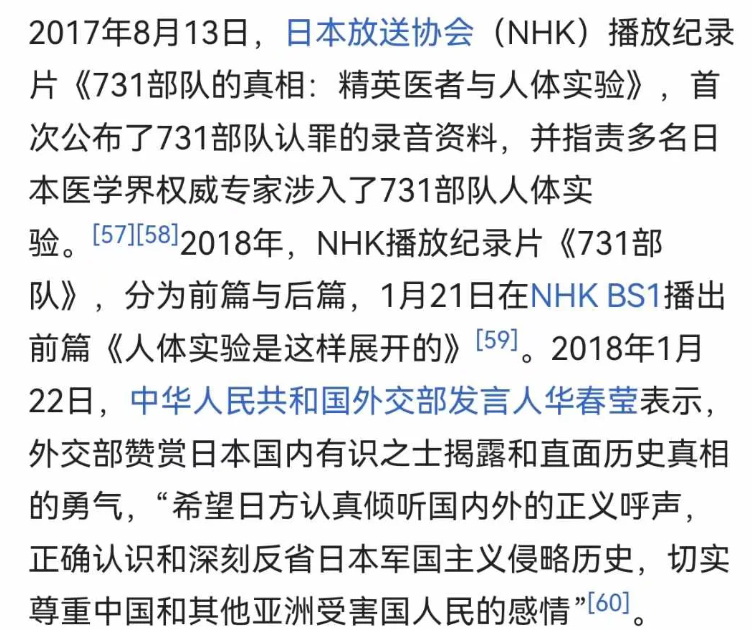
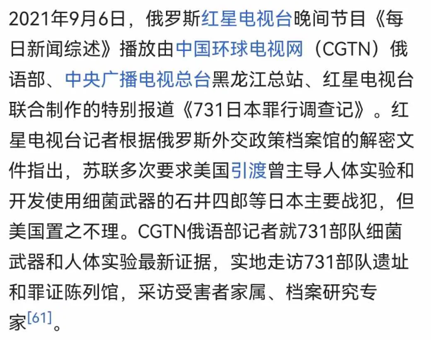

我小时候听说731部队的囚犯无一人生还，还听说涉案的学者们无一人受罚。

我前几天去查了下，还真是。 

Fig 1: 无人生还。 

Fig 2: 几个飞黄腾达的科学家。 他妈的，要知道德国参与万湖会议和屠杀犹太人的罪犯全都收到应有的惩罚。 

Fig 3: 逃脱审判的可能原因。 

Fig 4: 伯力审判。 

Fig 5: 日本一些有良心的人。

Fig 6: 俄国一些有良心的人。

忘记历史就等同于背叛。

全人类都应思考为什么犯下这种罪行的罪犯却被赦免。

中国人更应该记住这两件事情。

科学家应该思考自己是否干过和731部队类似的事，这种科学不要也罢！

