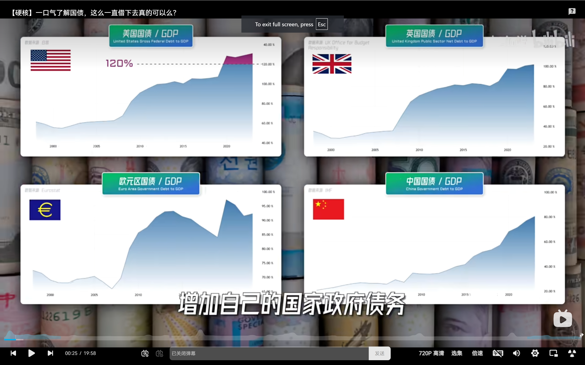
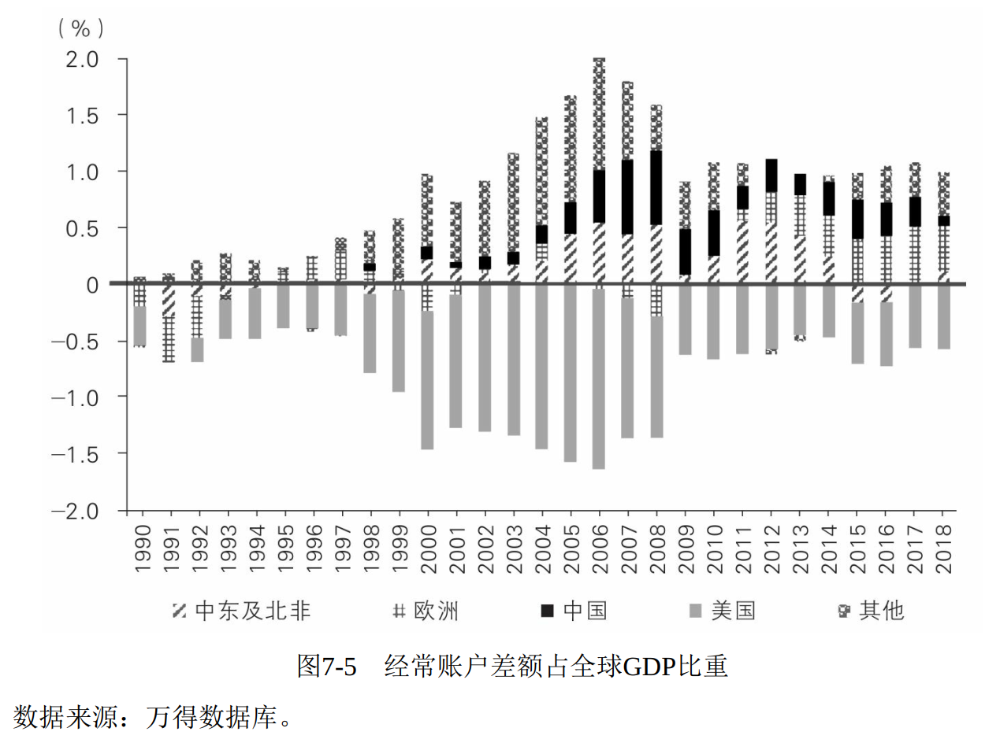

寒假，读了读有名的[《置身事内》](https://zh.wikipedia.org/wiki/%E7%BD%AE%E8%BA%AB%E4%BA%8B%E5%86%85%EF%BC%9A%E4%B8%AD%E5%9B%BD%E6%94%BF%E5%BA%9C%E4%B8%8E%E7%BB%8F%E6%B5%8E%E5%8F%91%E5%B1%95)，2021年出版。

# 历史

## 经济危机

小林力荐视频 [How The Economy Machine Works](https://www.youtube.com/watch?v=PHe0bXAIuk0&list=PLykIL_1_MFWmS82OuK8CBCow_QHUJuBes) 之出处：学名“[债务——通货紧缩——经济危机](https://zh.wikipedia.org/wiki/%E5%80%BA%E5%8A%A1%E5%9E%8B%E9%80%9A%E8%B4%A7%E7%B4%A7%E7%BC%A9)”，见第六章第一节。

### 国债

中国和美、欧、日国债之对比：和[小林所讲](https://www.bilibili.com/video/BV1LW4y1Q75v/?spm_id_from=333.1387.homepage.video_card.click)类似，此处引用林的图片。（因统计口径不同，此图和书中的图6-1略有区别）

（推测的）2006-2018 中国国债变化原因

#### 1994 分税制

#### 2008 中国凯恩斯

作者对四万亿计划（我更喜欢叫它中国凯恩斯计划）的看法：

> 第六章第三节：2008年至2009年， 为应对全球金融危机， 我国迅速出台“4万亿”计划。 其中中央政府投资1.18万亿元（包括对汶川地震重建的拨款） ， 地方政府投资2.82万亿元。 为配合政策落地、 帮助地方政府融资， 中央放松了对地方融资平台的限制 。
>
> ...
>
> 第六章第四节：当下债务问题的直接起因是2008年的全球金融危机。 当时金融海啸一浪高过一浪， 出口订单锐减， 若刺激力度不够， 谁也不知道后果会如何。 虽然现在回过头看， 有不少声音认为“4万亿”计划用力过猛，但历史不能假设。  

我倒是很想知道作者对24年的中国特别国债之看法。

### 消费

供和需是经济学的核心之一。  

**如果站在国家、政府、市场经济的角度，所有人天天月光才是最好的；但是站在个人角度，肯定不能这么干。**

小林在分析[2023年](https://www.youtube.com/watch?v=pYIwaHYmcUs&t=501s)和[2024年](https://www.bilibili.com/video/BV1ttk9YkEVx/?spm_id_from=333.1387.search.video_card.click&vd_source=7f7311e573a7f2a9bab48f7645a4e660)美国经济时，曾说，她认为，之所以出乎意料，是因为美国人民消费出乎意料地强。

图7-2中，总消费 = 居民最终消费 + 政府消费。

根据图7-3，中国居民更喜欢存钱。

作者认为

> 语言、 文化、 习惯等因素长期不变，解释不了我国储蓄率近些年的起起落落， 所以还得从分析经济环境的变化入手。   

作者认可的参考资料推测，原因如下：（具体分析见第七章第一节）

1. 计划生育
2. 政府民生支出不足
3. 房价上涨
4. 中国加入WTO，见图7-4

#### 全球化

对第四点，作者写道：

> GDP由三大部分组成： 消费、 投资、 净出口（出口减进口） 。 我国加入WTO之后， 投资和净出口占比猛增（图7-4） ， 消费占比自然锐减（图7-2）   

评曰：

> 这种经济结构比较脆弱， 不可持续。 一来外国需求受国外政治、 经济变化影响很大， 难以掌控； 二来投资占比不可能一直保持在40%以上的高位。 超出消费能力的投资会变成过剩产能， 浪费严重。 欧美发达国家投资占GDP的比重只有20%—23%。  

#### 消费主义

尽管如此，低收入人群储蓄率很低。对于消费主义，作者写道：

> 房价上涨不仅会增加按揭债务负担， 还会拉大贫富差距， 进而刺激低收入人群举债消费， 这一现象被称为“消费下渗”（[trickle-down consumption](https://www.jstor.org/stable/24917120)） ， 这在发达国家是很普遍的。 (17)
>
> 2014—2017年间， 我国收入最低的50%的人储蓄基本为零甚至为负（入不敷出） 。 (18)
>
> 自2015年起， 信用卡、 蚂蚁花呗、 京东白条等各种个人消费贷激增。 
>
> 根据中国人民银行关于支付体系运行情况的数据， 2016—2018年这三年， 银行信用卡和借记卡内合计的应偿还信贷余额年均增幅接近30%。
>
>  2019年， 信用卡风险浮现， 各家银行纷纷刹车。
>
> 在负债的人当中， 低收入人群的债务负担尤其重。 城镇居民的平均债务收入比约为1.6， 而年收入6万元以下的家庭债务收入比接近3。 资产最少的20%的家庭还会更多使用民间借贷， 风险更大。 (19) 
>
> 2020年， 随着蚂蚁金服上市被叫停， 各种讨论年轻人“纵欲式消费”的文章在社交媒体上讨论热烈， 都与消费类债务急升的大背景有关。   
>
> 这种依靠借债的消费无法持续， 因为钱都被花掉了， 没有形成未来更高的收入， 债务负担只会越来越重  

### 2008 经济危机

第五章第一节，作者认为：

> 我国房价和居民债务的上涨虽然也会引发很多问题， 但不太可能突发美国式的房贷和金融危机。 
>
> 首先， 我国住房按揭首付比例一般高达30%， **而不像美国在金融危机前可以为零**， 所以银行风险小。 除非房价暴跌幅度超过首付比例， 否则居民不会违约按揭， 损失掉自己的首付。2018年末， 我国个人住房贷款的不良率仅为0.3%。 (21)
>
> 其次， 住房按揭形成的信贷资产， **没有被层层嵌套金融衍生品**， 在金融体系中来回翻滚，规模和风险被放大几十倍。 2019年末， 我国住房按揭资产证券（RMBS） 总量占按揭贷款的总量约3%， 而美国这个比率为63%， 这还不算基于这种证券的各种衍生产品。 (22)
>
> 再次， 由于资本账户管制， **外国资金很少参与我国的住房市场**。
>
> 综上所述， 像美国那样由房价下跌引发大量按揭违约， 并触发衍生品连锁雪崩， 再通过金融市场扩散至全球的危机， 在我国不太可能会出现。

这段话一是点明了作者对08经济危机的看法，二是对未来做出了预测。  

#### 经济危机对穷富的打击

有关经济危机对富人和穷人的打击，作者写到：

> 低收入人群的财富几乎全部是房产， 其中大部分是欠银行的按揭， 负债率很高， 很容易受到房价下跌的打击。 
>
> 在2008年美国的房贷危机中， 每4套按揭贷款中就有1套资不抵债， 很多穷人的资产一夜清零。 
>
> 2007年至2010年， 美国最穷的20%的人， 净资产从平均3万美元下降到几乎为零。 而最富的20%的人， 净资产只下跌了不到10%， 从平均320万美元变成了290万美元， 而且这种下跌非常短暂。 
>
> 2016年， 随着股市和房市的反弹， 最富的10%的人实际财富（扣除通货膨胀） 比危机前还增长了16%。 但收入底部的50%的人， 实际财富被腰斩， 回到了1971年的水平。 40年的积累， 在一场危机后荡然无存 

#### 杠杆对经济危机的促进

有关加杠杆对经济危机的促进作用，作者写到（这点和 Ray Dalio、林 的看法一致）：

> 居民债务居高不下， 就很难抵御经济衰退， 尤其是房产价格下跌所引发的经济衰退。   

## 贫富差距

### 极端贫困人口

改革开放后中国极端贫困人口的变化（这张图出乎我的意料）

### 人口流动

作者写：

> 我们先来看看如果人口可以自由流动， 地区间平衡是个什么样子。  

### 阶级壁垒

第五章第一节，作者写：

> 最近这些年， 美国种族冲突加剧， 根本原因之一就是黑人的贫困。 黑人家庭的收入中位数不及白人的六成， 且这种差距可能一代代延续下去。 一个出身贫困（父母家庭收入属于最低的20%） 的白人， “逆袭”成为富人（同代家庭收入最高的20%） 的概率是**10.6%**， 而继续贫困下去的概率是29%。 但对一个出身贫困的黑人来说， “逆袭”的概率只有区区**2.5%**， 但继续贫困的概率却高达37%  

### 中美对比

对于美国，作者写：（第五章第三节）

> 美国情况则不同， 自20世纪70年代以来， 穷人（收入最低的50%） 的实际收入完全没有增长， 中产（收入居中的40%） 的收入近40年的累积增幅不过区区35%， 而富人（收入最高的10%） 的收入却增长了2.5倍。 因此社会越来越无法容忍贫富差距。2008年的全球金融危机让穷人财富大幅缩水， 贫富差距进一步扩大， 引发了“占领华尔街运动”， 之后特朗普当选， 美国政治和社会的分裂越来越严重。

对于中国，作者写：

> 1988年至2018年， 无论是在城镇还是在农村， 人均实际可支配收入（扣除物价上涨因素） 都增加了8—10倍。 无论是低收入人群、 中等收入人群还是高收入人群， 收入都在快速增加。 以城镇居民为例， 虽然收入最高的20%其实际收入30年间增长了约13倍， 但收入最低的40%和居中的40%的收入也分别增长了6倍和9倍。   
>
> 如果穷人的队伍完全静止不动， 哪怕富人队伍的前进速度也减慢了， 困在原地的穷人也会很快失去耐心而骚动起来。 这种现象被称为“隧道效应”（tunnel effect） 。
>
> ...
>
> 按照中国人民银行的调查数据， 北京居民的户均总资产（不是净资产， 未扣除房贷和其他负债） 是893万元， 上海是807万元， 是新疆（128万元） 和吉林（142万元） 的六七倍。 这个差距大部分来自房价。房价上涨也拉大了同城之内的不平等。 房价高的城市房屋空置率往往也高， 一边很多人买不起房， 一边很多房子空置。 如果把房子在内的所有家庭财富（净资产） 算在一起的话， 按照上述中国人民银行的调查数据， **2019年最富有的10%的人占有总财富的49%， 而最穷的40%的人只占有总财富的8%。 (16)**  

## 工业化

前三十年计划经济对后四十年市场经济的帮助：1964年开始的**“三线建设”**，逐渐把农民变成了工人，见第八章第一节。

注：三线建设的具体细节可参考温铁军的《八次危机》，这本书对历史的描写更加详细，包括三次上山下乡、三线建设、四三方案等。但此书学术用语较多，并不通俗易懂。

我理解的工业化是——两次工业革命前后的变化。石油、钢铁、房地产、制造业，都是工业化后的产业。至于第三次（电子计算机）、第四次工业革命（人工智能），肯定会掀起新的产业，但通常说“工业化”时指的仍是前两次，因为有很多后发国家还没有完成工业化。

### 制造业

中国和其他国家制造业之对比。（这点小林还没讲过，她只讲过[供应链](https://www.bilibili.com/video/BV1gAHseeEDT/?spm_id_from=333.1387.search.video_card.click&vd_source=7f7311e573a7f2a9bab48f7645a4e660)）（这张图出乎我的意料，我以后十分希望去做实业，特别是科技企业，看来中国仍将是我的归宿）

### 房地产

小林[有一期总览房地产](https://www.youtube.com/watch?v=cBLbDn5RJlw)，亦[有一期专讲2023年中国房地产危机](https://www.youtube.com/watch?v=JR08d91XPsA)。

改革开放后中国城镇人口的变化

作者推测中国房价高背后的原因：

> 我国的**城市化速度很快**， 居民收入增长的速度也很快， 所以住房需求和房价上涨很快。 按照国家统计局的数据， 自1998年住房商品化改革以来， 全国商品房均价在20年间涨了4.2倍。 但各地涨幅大不相同。 三四线城市在2015年实行货币化棚改（见第六章） 之前， **房价涨幅和当地人均收入涨幅差不多**； 但在二线城市， 房价就比人均收入涨得快了； 到了一线城市， 房价涨幅远远超过了收入： 2015年之前的十年间， 北、上、 广、 深房价翻了两番， **年均增速13%**。
>
> 地区房价差异的主要原因是供需失衡。 人口大量涌入的大城市， **居住用地的供给速度远赶不上人口增长**。 2006年至2014年， 500万人和1000万人以上的大城市城区人口增量占全国城区人口增量的近四成， 但居住用地增量才占全国增量的两成， 房价自然快速上涨。 而在300万人以下尤其是100万人以下的小城市中， 居住用地增量比城镇人口增量更快， 房价自然涨不上去。 从地理分布上看， 东部地区的城镇人口要比用地增速高出近10%， 住房十分紧张； 而西部和东北地区则反过来， 建设用地指标增加得比人口快。  
>
> 中国对建设用地指标实行严格管理， **每年的新增指标由中央分配到省， 再由省分配到地方。** 这些指标无法跨省交易， 所以即使面对大量人口流入， 东部也无法从西部调剂用地指标。 2003年后的十年间， 为了支持西部大开发并限制大城市人口规模， 用地指标和土地供给不但没有向人口大量流入的东部倾斜， 反而更加向中西部和中小城市倾斜。 2003年， 中西部土地供给面积占全国新增供给的比重不足三成， 2014年上升到了六成。 2002年， 中小城市建成区面积占全国的比重接近一半， 2013年上升到了64%。 (5)土地流向与人口流向背道而驰， 地区间房价差距因此越拉越大。  
>
> ...
>
> 发达地区土地需求旺盛， 地价大涨， **本应增加用地指标， 既满足需求也抑制地价**。 但因为土地分配受制于行政边界， 结果却是欠发达地区能以超低价格（甚至免费） 大量供应土地。 这种“东边干旱， 西边浇水”的模式需要改革。 **2020年， 中央提出要对建设用地指标的跨区域流转进行改革(《中共中央 国务院关于构建更加完善的要素市场化配置体制机制的意见》)**， 探索建立全国性建设用地指标跨区域交易机制（见第二节） ， 已是针对这一情况的改革尝试 

但作者并没有分析为什么要制订这样的政策——“中国对建设用地指标实行严格管理， 每年的新增指标由中央分配到省， 再由省分配到地方。 这些指标无法跨省交易， 所以即使面对大量人口流入， 东部也无法从西部调剂用地指标。”

**我嗅到这背后定有深意，但也分辨不出。**

中国和美、欧、日 居民债务/GDP 之对比

作者分析美、欧的教训

> 在西方， “自有住房”其实是个比较新的现象， **“二战”之前， 大部分人并没有自己的房子。** 哪怕在人少地多的美国， 1900—1940年的自有住房率也就45%左右。 “二战”后这一比率才开始增长， 到2008年全球金融危机之前达到68%。 英国也差不多， “二战”前的自有住房率基本在30%， 战后才开始增长， 全球金融危机前达到70%。   
>
> 1950年至2010年， 英国房产价值占国民财富的比例从36%上升到57%， 法国从28%升到61%， 德国从28%升到57%， 美国从38%升到42%。   
>
> 政府为讨好这部分选民， 不愿让房价下跌。 
>
> 无房者也想尽快买房， 赶上房价上涨的财富快车。
>
> 政府于是顺水推舟， 降低了买房的首付门槛和按揭利率 

## 中美斗法

### 贸易顺逆

评曰：

> 我国国内产出没有被国内消费和投资完全消耗掉， 因此出口大于进口， 经常账户（可以简单理解为货物和服务进出口情况的总结） 是顺差， 对外净输出。 
>
> 美国的国内产出满足不了本国消费和投资需求， 因此进口大于出口， 经常账户是逆差， 对外净输入。   
>
> 图7-5有两个显著的特点。 
>
> 第一， 20世纪90年代的失衡情况不严重， 约占全球GDP的0.5%以内。 从21世纪初开始失衡加剧， 在全球金融危机前达到顶峰， 约占全球GDP的1.5%—2%。 危机后， 失衡情况有所缓解， 下降到全球GDP的1%以内。 
>
> 第二， 全球经常账户的逆差基本全部由美国构成， 而顺差大都由中国、 欧洲和中东构成。 
>
> 美国每年进口都大于出口， 相当于不断从国外“借入”资源， 是世界最大的债务国。 但这些外债几乎都以美元计价， 原则上美国总可以“印美元还债”， 不会违约。 换句话说， 只要全世界还信任美元的价值， 美国就可以源源不断地用美元去换取他国实际的产品和资源， 这是一种其他国家所没有的、 实实在在的“挥霍的特权”（exorbitant privilege） 。 (19)
>
> 在美国的所有贸易逆差中， 与中国的双边逆差所占比重不断加大， 从21世纪头几年的四分之一上升到了最近五年的五成到六成。 因此美国虽和多国都有贸易冲突， 但一直视中国为最主要对手。 (20)

### 制造业之争

评曰：

> 在中美贸易冲突中， 美国政客和媒体最常提起的话题之一就是“中国制造抢走了美国工人的工作”。 主要论据如下： 20世纪90年代美国制造业就业占劳动人口的比重一直比较稳定， 但在中国加入WTO之后，中国货冲击美国各地， 工厂纷纷转移至海外， 制造业就业占比大幅下滑。 受中国货冲击越严重的地区， 制造业就业下滑越多。 (21)  
>
> 从数据上看， 似乎确实有这个现象。 图7-6中两条黑线中间的部分显示： 20世纪90年代， 美国制造业就业占劳动人口的比重稳定在15%左右， 从2001年开始加速下滑， 2008年全球金融危机前下降到了11%。 然而在两条黑线之外， 更明显的现象是制造业就业从70年代开始就一直在下降， 从26%一直下降到个位数。 就算把21世纪初下滑的4个百分点全赖在和中国的贸易头上， 美国学界和媒体所谓的“中国综合征”在这个大趋势里也无足轻重。 此外， 虽然制造业就业一直在下跌， 但是从1970年到2013年， 制造业创造的增加值占美国GDP的比重一直稳定在13%左右。 (22)
>
> 人虽少了， 但产出并没有减少， 这是典型的技术进步和生产率提高的表现。 机器替代了人工而已， 并没什么特别之处。 农业技术进步也曾让农民越来越少， 但农业产出并没有降低。
>
>  另一方面， 从中国进口的产品价格低廉， 降低了使用这些产品的部门的成本， 刺激了其规模和就业扩张， 其中既有制造业也有服务业。 虽然确有部分工人因工厂关闭而失业， 但美国整体就业情况并未因中美贸易而降低。 (23)  

### 科学技术之争

评曰：

> 这些数量指标当然不能完全代表质量。 但在工业和科技领域， 没有数量做基础， 也就谈不上质量。 
>
> 此外， 这些数据都是每年新增的流量，不是累积的存量。 若论累积的科技家底， 比如专利保有量和科研水平，中国还远远赶不上美国。   
>
> 2010年， 我国制造业增加值超过美国。 又过了10年， 2019年中国的国际专利申请数量超过美国。 而按照目前的科学论文增长率， 2025年左右中国就可能超过美国  
>
> 我用苹果公司生产的iPhone来举个例子。 多年前， 媒体和分析家中流传一种说法： 一台“中国制造”的iPhone， 卖大几百美元， **但中国大陆贡献的价值只不过是富士康区区二三美元的组装费**。 最近两年， 仍然时不时还会看到有人引用这个数据， 但这与事实相差太远。 苹果公司每年都会公布前200家供应商名单， 这些公司占了苹果公司原材料、 制造和组装金额的98%。 在2019年版的名单中， 中国大陆和香港的企业一共有40家， 其中大陆企业30家， 包括多家上市公司。 (27)在A股市场上， 早有所谓的“果链概念”， 包括制造iPhone后盖的蓝思科技、 摄像头模组的欧菲光、 发声单元的歌尔股份、 电池的德赛电池等上市公司。 虽然很难估计在一台iPhone中， 中国（含香港） 产业链贡献的精确增加值， 但从国内外一些“拆机报告”中估计的各种零部件价格看， **中国（含香港） 企业应该贡献了iPhone硬件价值的两成左右。**

第七章第二节，有关制造业就业和科学技术，作者写道：

> 中国制造业崛起和中美贸易对美国的就业冲击其实不重要。
>
> 相比之下， 对美国的技术冲击和挑战更加实实在在， 这也是**中美贸易冲突和美国技术遏制可能会长期化的根本原因。** 
>
> **虽然制造业占美国就业的比重已是个位数， 但制造业依旧是科技创新之本**， 美国研发支出和公司专利数量的六七成均来自制造业企业。  

# 未来

## 一个预测

虽然作者在后记中写：

> 这本书没有预测， 就是介绍些当下的情况。

但他实际上给出了一个预测：

> 我国房价和居民债务的上涨虽然也会引发很多问题，但不太可能突发美国式的房贷和金融危机。首先， 我国住房按揭首付比例一般高达30%， 而不像美国在金融危机前可以为零……

## 三个问题

> 当下最重要的问题不是我国的GDP总量哪年能超过美国， 而是探讨我国是否具备了下一步发展的基础和条件：
>
> 产业升级和科技进步还能继续齐头并进吗？ 
>
> 还有几亿的农民能继续城市（镇） 化吗？ 
>
> 贫富差距能控制在社会可承受的范围内吗？   

[小林曾说](https://www.youtube.com/watch?v=pYIwaHYmcUs&t=1200s)，她看一国经济会看四个方面（都和经济危机息息相关）：经济增长、物价、失业、贫富差距。对应四个定量指标：GDP、CPI、失业率、基尼指数。

## 一个警告

> 并没有什么神秘的经济力量会自动降低收入不平等， **“先富带动后富”也不会自然发生**， 而需要政策的干预。 不断扩大的不平等会让社会付出沉重的代价， 必须小心谨慎地对待。[44]
>
> [44] 诺贝尔经济学奖得主斯蒂格利茨（Stiglitz） 的著作（2013） 讨论了不平等的种种代价。 斯坦福大学历史学教授沙伊德尔（Scheidel） 的著作（2019） 指出， **历史上不断扩大的不平等几乎都难以善终**， 最后往往以大规模的暴力和灾难重新洗牌。  

# 生活启示

了解这些宏观经济对个人生活有啥用呢？

引用小林的话作为结语：

> 但老实说，对我们大多数人来说，了解宏观和分析房地产市场是一回事
>
> 但是，当涉及到我们个人买房的决定时，我们实际上很清楚：当你决定在这个城市安顿下来时，你已经攒够了钱，你的工作稳定了，然后你就可以贷款买房子了。
>
> 毕竟，这是我自己的，感觉就像我的家。
>
> 所以你不会看平均工资，人口统计。
>
> 这才叫生活。
>
> 对吧？